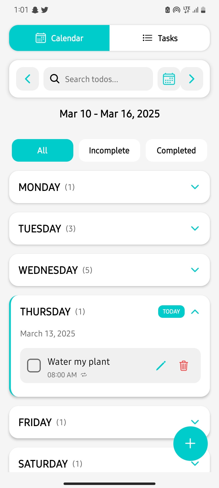
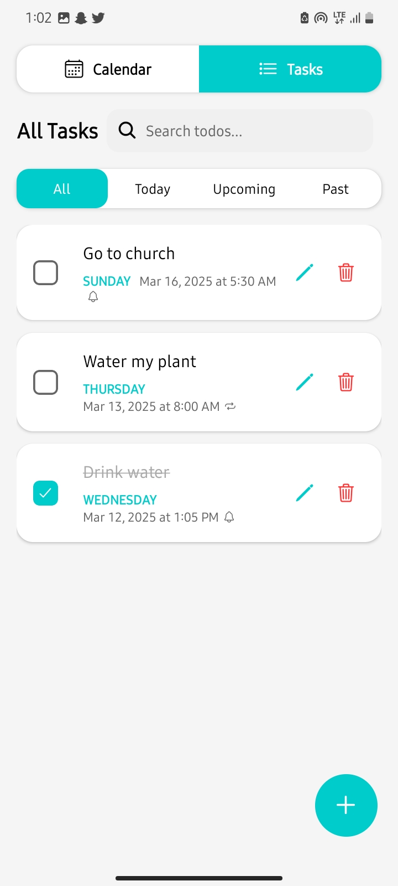
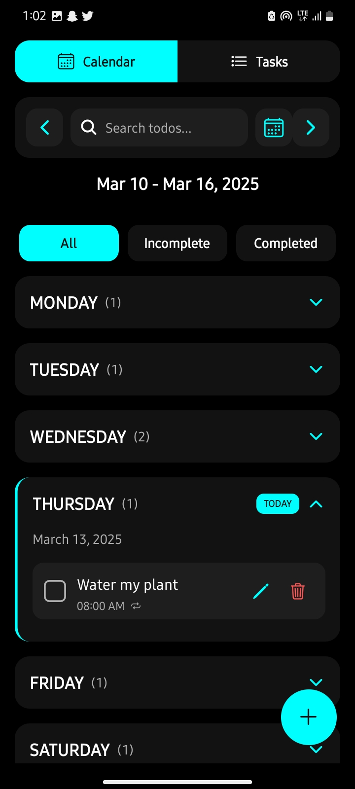

<div align="center">
  <h1> Jvst do it!</h1>
  <p><strong>A minimal but powerful, feature-rich task management app built with React Native</strong></p>
  
  <p>
    <a href="#features">Features</a> •
    <a href="#demo">Demo</a> •
    <a href="#installation">Installation</a>
  </p>
  
  
  
  
  
</div>

## 🌟 Features

Jvst do it! is a next-generation task management application designed to boost your productivity with a beautiful, intuitive interface and powerful features:

- **📱 Dual View System**
  - Calendar view for weekly planning
  - List view for comprehensive task overview
- **🔄 Smart Recurrence**
  - Set tasks to repeat daily, weekly, or monthly
  - Intelligent handling of recurring task completion states
- **🔔 Advanced Notifications**
  - Customizable reminders (at due time, 30 min before, 1 hour before)
  - Permission handling and notification management
- **🎨 Adaptive Theming**
  - Automatic dark/light mode based on system preferences
  - Carefully crafted color schemes for both modes
- **🔍 Powerful Search**
  - Full-text search across all tasks
  - Real-time results with animations
- **✨ Polished UX**
  - Fluid animations and transitions
  - Haptic feedback
- **💾 Persistent Storage**
  - Automatic saving of tasks
  - Offline design

## 📱 Demo

<div align="center">
  <table>
    <tr>
      <td align="center"><strong>Calendar View</strong></td>
      <td align="center"><strong>List View</strong></td>
      <td align="center"><strong>Dark Mode</strong></td>
    </tr>
    <tr>
      <td></td>
      <td></td>
      <td></td>
    </tr>
  </table>
</div>

## 🚀 Installation

### Prerequisites

- Node.js (v16 or newer)
- npm or yarn
- iOS: XCode and CocoaPods
- Android: Android Studio and SDK

### Setup

```bash
# Clone the repository
git clone https://github.com/justuche224/jvst-do-it-app.git

# Navigate to project directory
cd jvst-do-it-app

# Install dependencies
npm install
# or
yarn install

# Install pods (iOS)
npx pod-install

# Start the development server
npm start
# or
yarn start
```
